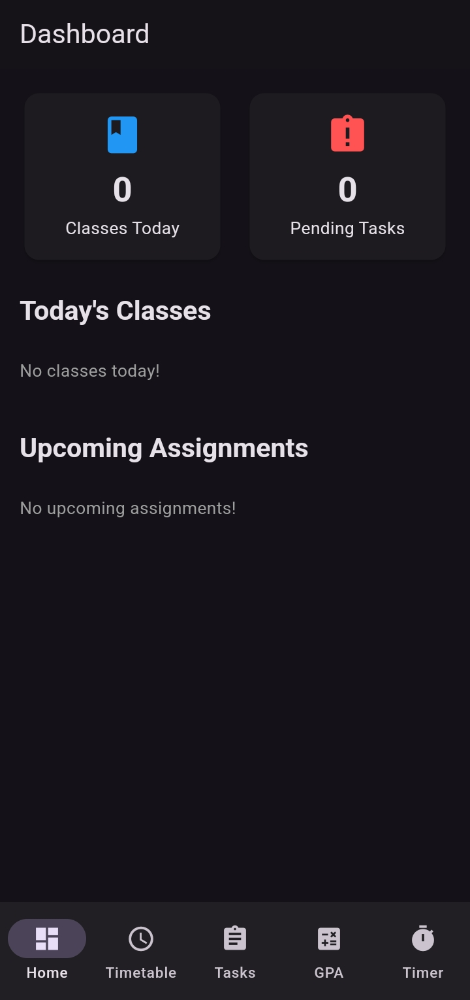
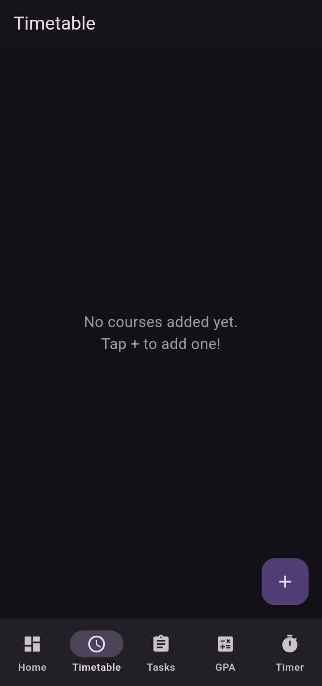
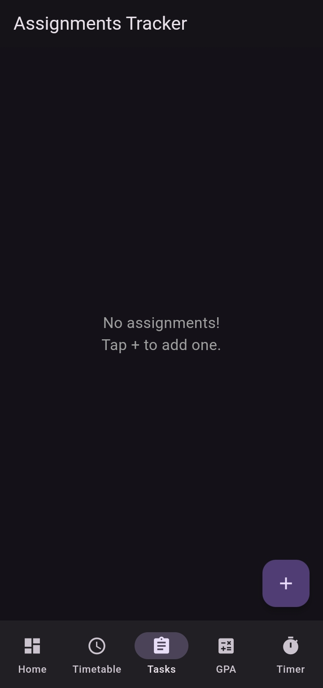
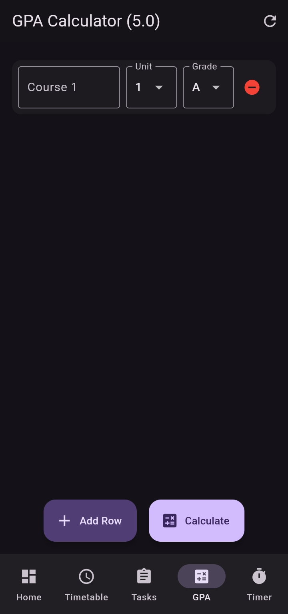
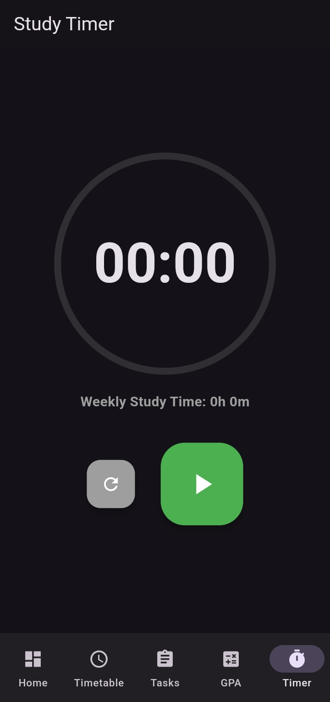

# Smart Student Companion 🎓

A comprehensive, strictly **offline** mobile application built with Flutter to help students efficiently manage their academic lives. This app combines class scheduling, task management, GPA calculation, and study habit tracking all into one smooth, centralized dashboard.

## Screenshots 📸

<p align="center">
  
  
  
  
  
</p>

## Features ✨

The application is divided into five core modules designed to maximize productivity:

1. **Dashboard**
   - Quick overview of your classes for the current day.
   - Immediate view of upcoming assignment deadlines.
2. **Timetable**
   - Plan out your weekly class schedule.
   - Automatically sorts classes by time and day. 
3. **Assignment Tracker**
   - Track all pending and completed assignments.
   - Highlights overdue tasks so you never miss a deadline.
4. **GPA Calculator**
   - Calculates your Grade Point Average on a 5.0 scale.
   - Easily add multiple courses, credits, and grades to see your standing.
5. **Study Timer**
   - An active study timer that tracks your current focus session.
   - Persistently logs and accumulates your **Weekly Study Time** so you can see how much effort you've put in throughout the week.
## Direct Download Link
[Download APK](https://github.com/ibraheem3981/smart_students_companion/releases/download/v1.0/Smart.Students.Companion.apk)

## How It Works 🛠️

- **Tech Stack:** Flutter Framework & Dart
- **Storage:** Offline only. The app uses `SharedPreferences` to persistently save your timetable, assignments, and study times directly to your device's local storage.
- **State Management:** Uses the `Provider` package to reliably update the UI across multiple screens whenever your local data changes.

## Prerequisites 📋

To run and build this project from source, you will need:
- [Flutter SDK](https://docs.flutter.dev/get-started/install) (Version 3.5.4 or higher)
- Android Studio or VS Code (with the Flutter and Dart extensions installed)
- An Android Emulator, or a physical Android device connected via USB debugging.

## How to Run 🚀

### 1. Clone the repository
```bash
git clone https://github.com/ibraheem3981/smart_students_companion.git
cd smart_student_companion
```

### 2. Install dependencies
Fetch all required Dart packages:
```bash
flutter pub get
```

### 3. Run the app
Ensure your emulator is running or your Android device is connected, then execute:
```bash
flutter run
```

## How to Build the Release APK 📦

If you want to install this app permanently on your Android phone without keeping it connected to your computer:

1. Build the release APKs (split by ABI reduces file size):
```bash
flutter build apk --release --split-per-abi
```
2. Navigate to `build\app\outputs\flutter-apk\` and transfer the appropriate `app-[abi]-release.apk` file to your phone's storage to install it!


## License 📜
This project is open-source and available under the standard MIT License. Feel free to fork or modify it.
